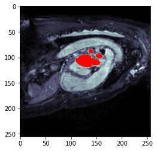
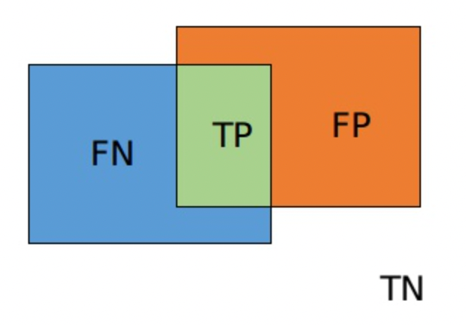

# Attrium Sementation :heart:

Automatically segment the left atrium in cardiac mri images
在心脏 mri 图像中自动分割左心房

## Medical Background :paw_prints:

- (Left) Atrium Segmentation classifies each voxel in the MRI into either "Not Left Atrium" or "Left Atrium" 

- Enables exact volume calculation
- Changes in atrial volume are assoicated with cardiac disorders, such as atria fibrillation or mitral valve stenosis (Narrowing of the mitral valve orifice, blocking blood flow) 
- Manual segmentation is tedious :arrow_right: **Automatize it**   :rocket:

## Data 🧸 

- Medical Segmentation [Decathlon](http://medicaldecathlon.com/)

- 20 MRI scans of the heart with corresponding Ground Truth mask
  - 4542 2D MRI and label slices

感谢kaggle上的老哥，找到了这个已经传好了的

https://www.kaggle.com/datasets/paddytheprogrammer/atriumsegmentaion


## Preprocessing :orange:

- Two dimensional setting. Extract slices!
- Original image shape ( 352 x 352 )
  - Crop away non-cardiac regions and background 
    - 32 px from all borders
    - Also applied to segmentation mask !

- Z-Normalization per subiect:

  - Compute mean and standard deviation for each subject separately

- Standardize the normalized subject into the interval [0,1]
  $$
  X_s=\frac{X_n-min(X_n)}{max(X_n)-min(X_n)}
  $$

- Use 16 patients as training data and the remaining 4 for validation

## Dataset :cookie:

- Custom Dataset
- Task :
  1. Create a list of all 2D slices
  2. Extract & load slice and corresponding label mask
  3. Data Augmentation. Augment slice and mask identically
  4. Return augmented slice and mask

- Data Augmentation:
  - Scaling (0 . 85, 1.15)
  - Rotation (-45°, 45°) 
  - ElasticTransformation

## Model :sparkles:

- UNET ( Ronnenberger et al. Miccai 2015)
- Encoder-Decoder architecture with skip connections
  - Encoder reduces the feature maps by using convolutions + max pooling
  - Decoder reconstructs segmentation mask by using Upsampling + Convolutions
  - Skip-Connections allow information flow from encoder to decoder

## Training :seedling:

- Optimizer : Adam (Ir = 1e-4)

- Dice Loss : $L(\hat{y},y)=1-\frac{2|\hat{y}\cap y|}{|\hat{y}|+|y|}$

- Use sigmoid activation function on the prediction

  - Threshold at 0.5
    - Predictions > 0 . 5- > Atrium
    - Prediction < = 0.5- > Not Atrium

- Train for 75 epochs

  ```python
  countetr = (pred * mask).sum() # Numeraator
  denum = pred.sum() + mask.sum() + 1e-8# Denominatior
  dice = 1-(2*counter)/denum
  ```



## Coding Time :icecream:


## Knoweldge Point :cheese:

#### dice coefficient

$$
dice = \frac{2|X \cap Y|}{|X|+|Y|}
$$


$$
dice = \frac{2TP}{2TP+FP+FN}
$$

#### dice loss

$$
L_{dice} = 1-\frac{2|X \cap Y|}{|X|+|Y|}
$$


