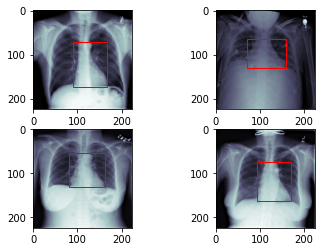
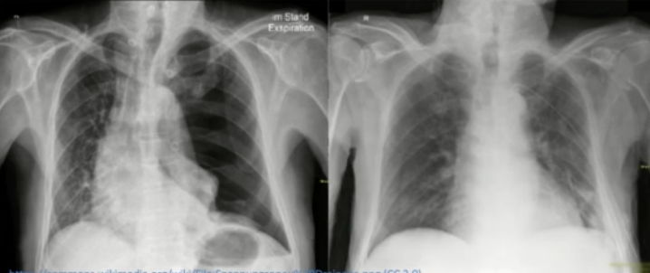
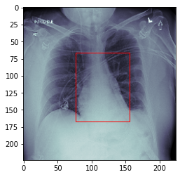

# Heart Detection :heart_decoration: in X-ray images

Predict a bounding box around the heart in X-ray images

- Preprocess the data for the cardiac detection task

- Create a custom DataSet which will load and return an X-Ray image together with the location of the heart

  

## Medical Background :paw_prints:

- Heart Detection indicates size and position of the heart

  - Cardiomyopathy ( a disease of the cardiac muscle which might lead to heart failure or blood clots ) often comes with an increased size of the heart
  - Pneumothorax and Atelectasis both ( collapsed lung ) may lead to cardiac displacement 

- Early detection reduces the risk of severe courses and long-term consequences

  

## Environment & Data 🧸 

Kaggle —— GPU P100

- **RSNA Pneumonia Detection Challenge**

  https://www.kaggle.com/competitions/rsna-pneumonia-detection-challenge

- 496 X-Ray images

  https://www.kaggle.com/datasets/joymei/rsna-heart-detection

Wang X, Peng Y, Lu L, Lu Z, Bagheri M, Summers RM. ChestX-ray8: Hospital-scale Chest X-ray Database and Benchmarks on Weakly-Supervised Classification and Localization of Common Thorax Diseases. IEEE CVPR 2017, http://openaccess.thecvf.com/content_cvpr_2017/papers/Wang_ChestX-ray8_Hospital-Scale_Chest_CVPR_2017_paper.pdf

## Preprocessing :orange:

* Original image shape（1024*1024）
  * Resize-224*224(downsize)
  * **Caution:Bounding boxes must also be scalsed** 
    * in this case we skip this, because the labels were taken on images of size(224*224)
* Standardize the pixel values into the interval [0,1] by scaling with 1/255
* split dataset into 400 train images and 96 validation images
  * Store train and validation subject ids
* compute training mean and standard deviation for normalization

## Dataset :cookie:

* custom dataset
* Task:
  * given a subject idx, load the corresponding X-ray image and bounding box coordinates(xmin,xmax,ymin,ymax)
* Z-normalize images with coumputed mean and std $$x_{norm}=\frac{x-\mu}{\sigma}$$
* apply data augmentation:
  * (Gamma) contrast changes (0.7,1.7)
  * Scaling(0.8,1.2) 
  * Rotation(-10°,10°)
  * Translation(-10px,10px)
  * **IMPORTANT:Augment image and bounding box identically** 相同地增强图像和边界框

## Model :sparkles:

#### Network architecture: ResNet-18 :cheese:

#### Our Model :icecream:

**1 Input** : The original ResNet expects a three channel input in **conv1**, However, our X-Ray image data has only one channel. Thus we need to change the in_channel parameter from 3 to 1.

**4 outputs**: We need to estimate the location of the heart (xmin, ymin, xmax, ymax).

**Loss function**: We are going to use the L2 loss ( **Mean Squared Error** ), as we are dealing with continuous values.

## Training :seedling:

* Network architecture:ResNet18

  * Change input channels from 3 to 1
  * Change output dimension from 1000 to 4

* Loss function:Mean Squared Error

* Optimizer:Adam(lr=1e-4)

* Train for 50 epochs

  

## End 🥳

:tada: 完结撒花 ✿✿ヽ(ﾟ▽ﾟ)ノ✿ :cherry_blossom:

