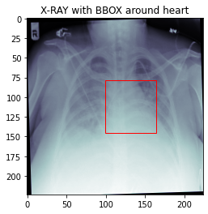
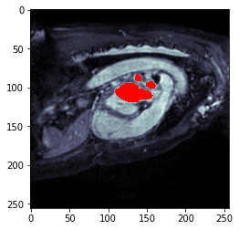

# Medical-Image

### Heart Detection 💟

:link: https://github.com/JoyMei/Medical-Image/tree/main/Heart%20Detection

Predict a bounding box around the heart in X-ray images

### Atrium Segmentation 

:link: https://github.com/JoyMei/Medical-Image/tree/main/Atrium%20Segmentation

Automatically segment the left atrium in cardiac MRI images

